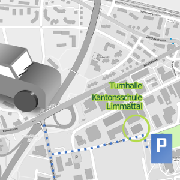
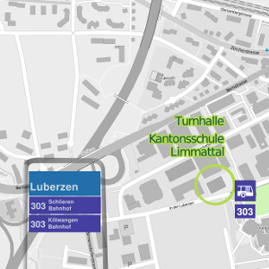
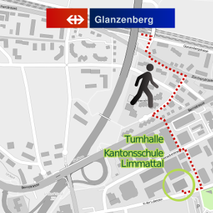

# Spielort

Wir haben eine der beiden _alten_ Sporthallen in der Kantonsschule Limmattal gemietet, und zwar jeden Freitag von 19:30 bis 22:30 Uhr.

Die Halle hat 4 Spielfelder. Wartezeiten gibt's bei uns deshalb nicht!

_Achtung_: die Halle ist nicht im Hauptgebäude, sondern direkt neben der Tramhaltestelle "Luberzen".

## Mit dem Velo und zu Fuss

Entweder Über "In der Luberzen" oder direkt vom Spital Limmattal, kommt man aus allen Richtungen komfortabel zur Halle.

## Mit dem Auto

Von der Birmensdorferstrasse, in die Strasse "In der Luberzen" einbiegen. Nach etwa 500 Meter findest du auf der linken Seite die Halle und gegenüber auf der rechten Seite die Parkplätze der Kanti Limmattal.

## Mit dem Bus

Der Bus 303 fährt ab dem Bahnhof Dietikon um 19:09 Ricthung Schlieren. Die Haltestelle "Luberzen" liegt direkt bei der Turnhalle.

In der anderer Ricthung, fährt der Bus 303 ab Schlieren Zentrum / Bahnhof um 19:22. Dieser hat Anschluss auf dem Tram 2 aus der Stadt Zürich.

> Acthung: die Linie 303 wird wegen der Limmattalbahn-Baustelle umgeleitet und die Provisorische Haltestelle ist ein paar Minuten entfernt von der Halle.

## Mit dem Zug

Die S-Bahnen S11 und S12 halten in Glanzenberg (Ankunft aus Zürich: 19:11; Ankunft aus Dietikon 19:17). Von dort läuft man zehn Minuten bis zur Halle (siehe Plan nebenan)
